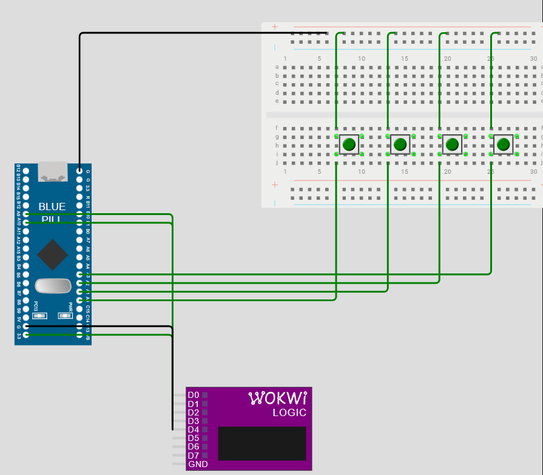
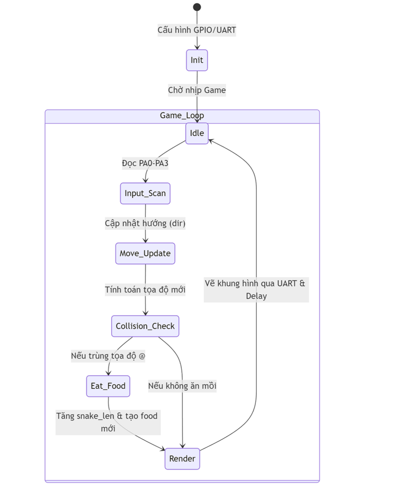
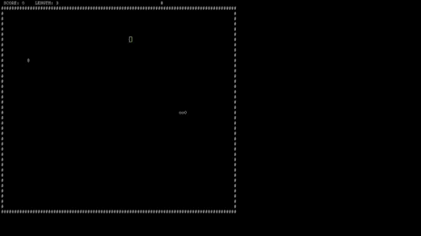
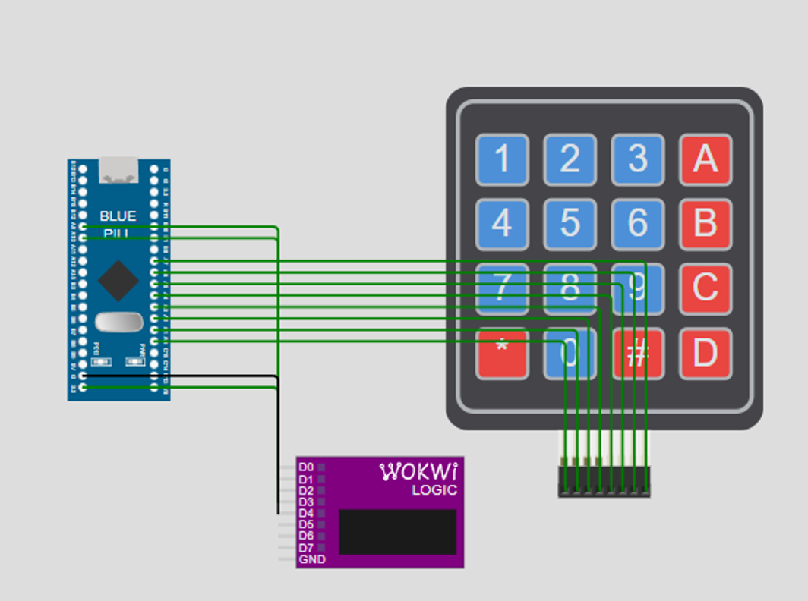
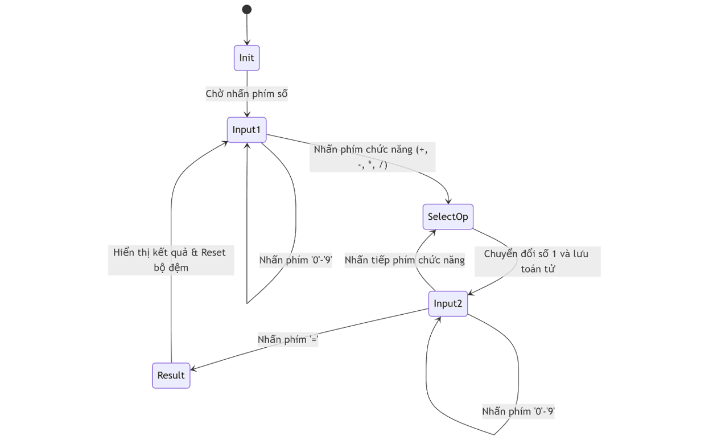

# Giới thiệu chung

Repository này bao gồm 2 project lập trình thanh ghi trên vi điều khiển STM32F103C8T6:

- 🐍 Snake Game hiển thị trên Terminal máy tính qua UART
- 🧮 Máy tính bỏ túi sử dụng Keypad 4x4

⚠️ Toàn bộ chương trình được viết thuần thanh ghi (không dùng HAL, không dùng CubeMX) nhằm mục đích:

- Hiểu sâu về kiến trúc STM32
- Làm chủ GPIO, UART, SysTick, Interrupt
- Thực hành Embedded System ở mức thấp
---
## 1. Rắn săn mồi

Dự án mô phỏng trò chơi Snake huyền thoại hiển thị trên Terminal máy tính thông qua giao tiếp UART.

### Các cập nhật và tối ưu hóa đã thực hiện:
ANSI Escape Codes để tối ưu hiển thị Terminal
Để khắc phục hiện tượng giật lag và nhấp nháy màn hình, các kỹ thuật sau đã được áp dụng:
* **Vẽ qua Buffer (Mảng đệm):** Thay vì gửi từng ký tự đơn lẻ, toàn bộ bản đồ được xây dựng trong một chuỗi `char screen_buf[]` lớn và gửi một lần duy nhất qua UART để tăng tốc độ hiển thị.
* **Sử dụng SysTick Timer:** Loại bỏ vòng lặp `delay` bằng lệnh `for`. Sử dụng ngắt `SysTick` (1ms) để tạo nhịp di chuyển ổn định cho con rắn, giúp nút bấm nhạy hơn và không bị block.
* **ANSI Escape Codes:**
    * `\033[H`: Đưa con trỏ về đầu trang thay vì xóa toàn bộ màn hình, giảm nhấp nháy.
    * `\033[?25l`: Ẩn con trỏ chuột màu xanh nhấp nháy để mang lại trải nghiệm game chuyên nghiệp.
* **Tăng tốc độ truyền:** Khuyến nghị cấu hình Baudrate lên **115200** (thay vì 9600) để xử lý lượng dữ liệu lớn từ khung hình.
### Linh kiện
4 nút bấm, blue pill, uart, mạch nạp stlink.
### Sơ đồ mạch

### Sơ trạng thái

### Demo


### Hướng dẫn cài đặt
---

## 2. Máy tính bỏ túi

Dự án thực hiện các phép tính cơ bản thông qua Ma trận phím (Keypad 4x4) và hiển thị kết quả.
### Linh kiện
Blue pill, uart, Ma trận nút 4x4, mạch nạp stlink.
### Sơ đồ mạch

### Sơ đồ trạng thái

### Chức năng chính:
* **Quét Ma trận phím:** Sử dụng thuật toán quét hàng/cột để nhận diện phím nhấn từ Keypad 4x4.
* **Xử lý tính toán:** Thực hiện các phép toán cộng, trừ, nhân, chia số nguyên.
* **Hiển thị:** Kết quả được gửi qua UART để theo dõi trên máy tính hoặc hiển thị qua LCD (tùy cấu hình).
### Demo


----
## Cài đặt
### Cài đặt các phần mềm cần thiết
- STM32CubeIDE
- ST-Link Driver
- PuTTY
### Thêm CMSIS Header vào Project
- Bước 1: Clone CMSIS
```
git clone https://github.com/modm-io/cmsis-header-stm32
git clone https://github.com/ARM-software/CMSIS_4.git
```
- Bước 2: Copy vào project của bạn

```
CMSIS/Core/Include

CMSIS/Device/ST/STM32F1xx
```

- Bước 3: Add Include Path trong STM32CubeIDE vào:

```Project Properties
→ C/C++ General
→ Paths and Symbols
→ Includes
```

Thêm đường dẫn tới thư mục CMSIS.
### Hướng dẫn biên dịch và nạp code
- Bước 1: Import project
     - Mở STM32CubeIDE
     - File → Import → Existing Projects into Workspace
     - Chọn thư mục project
- Bước 2: Build
```
Project → Build Project
```
- Bước 3: Nạp chương trình

     - Kết nối ST-Link
     - Nhấn Debug hoặc Run

    - Chọn ST-Link Debug Configuration

    - Flash chương trình
